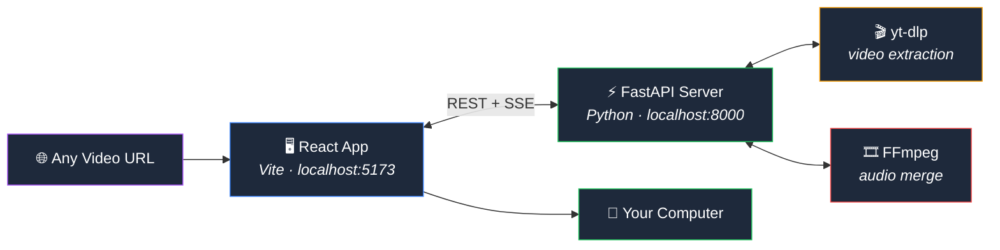

<div align="center">
  <br/>
  
  
  
  
  <br/><br/>
</div>

<h1 align="center">
  ⬇️ Downly
</h1>

<p align="center">
  <strong>Universal Video Downloader</strong><br/>
  Paste any video URL → pick quality → download directly to your computer.<br/>
  No accounts. No cloud storage. No limits.
</p>

<p align="center">
  <b>
    <a href="#features">Features</a> &middot;
    <a href="#quick-start">Quick Start</a> &middot;
    <a href="#architecture">Architecture</a> &middot;
    <a href="#deployment">Deployment</a> &middot;
    <a href="#tech-stack">Tech Stack</a> &middot;
    <a href="#api">API</a>
  </b>
</p>

<br/>

---
check this :
https://downly-qfpv.onrender.com

---

## ✨ Features

| Feature | Details |
|---------|---------|
| **🌐 1800+ Sites** | YouTube, Twitter/X, Instagram, TikTok, Facebook, Vimeo, Reddit, and more — powered by yt-dlp |
| **🎯 Maximum Quality** | Automatically selects the best available resolution up to 4K/8K, HDR, and 60fps |
| **🎵 Audio-Auto Merge** | DASH video-only formats get merged with best audio via FFmpeg — no manual work |
| **📊 Real-Time Progress** | Live download speed, ETA, file size, and animated progress bar via SSE |
| **🎨 Beautiful UI** | Dark glass design with per-quality color themes, animations, and responsive layout |
| **🔒 100% Private** | Everything runs on your machine. No data leaves your network. No signup. |
| **📦 Direct Download** | Files stream directly to your browser's save dialog — nothing stored permanently |
| **⚡ Fast Downloads** | Parallel fragment fetching for DASH streams, optimized yt-dlp settings |

## 🚀 Quick Start

### Prerequisites

| Tool | Version | Install |
|------|---------|---------|
| Python | 3.10+ | [python.org](https://python.org) |
| Node.js | 18+ | [nodejs.org](https://nodejs.org) |
| FFmpeg | latest | `winget install ffmpeg` or [ffmpeg.org](https://ffmpeg.org) |

### 1. Clone & Install

```bash
git clone https://github.com/Madhur-Bist/Downly.git
cd Downly

# Backend
cd backend
pip install -r requirements.txt

# Frontend
cd ../frontend
npm install
```

### 2. Run

Open **two terminals**:

**Terminal 1 — Backend (port 8000):**
```bash
cd backend
python main.py
```

**Terminal 2 — Frontend (port 5173):**
```bash
cd frontend
npm run dev
```

### 3. Use

Open **[http://localhost:5173](http://localhost:5173)** → paste any video URL → choose quality → download.

> 💡 Or just double-click `start.ps1` (Windows) to launch both at once.

---

## 🏗 Architecture



### Data Flow

```
1️⃣  User pastes URL
        │
2️⃣  Frontend → POST /api/analyze
        │
3️⃣  Backend runs yt-dlp --dump-json
        │
4️⃣  Backend returns title, thumbnail, all formats (resolution, codec, fps, file size)
        │
5️⃣  User selects quality in the visual grid
        │
6️⃣  Frontend → POST /api/download (format_id, url, hasAudio flag)
        │
7️⃣  Backend spawns yt-dlp download thread with progress hook
        │
8️⃣  Browser receives SSE stream with real-time: speed, ETA, progress %
        │
9️⃣  Download completes → FFmpeg merges audio if needed
        │
🔟  File served directly via GET /api/download/{id}/file → browser saves
```

---

## 📡 API

| Method | Endpoint | Description |
|--------|----------|-------------|
| `POST` | `/api/analyze` | Analyze video URL — returns title, thumbnail, all formats |
| `POST` | `/api/download` | Start download — returns `downloadId` |
| `GET` | `/api/download/{id}/status` | SSE stream of download progress |
| `GET` | `/api/download/{id}/file` | Download the completed file |

### Example: Analyze

```json
POST /api/analyze
{ "url": "https://youtube.com/watch?v=..." }

→ 200
{
  "title": "Amazing Video",
  "thumbnail": "https://i.ytimg.com/vi/.../hqdefault.jpg",
  "duration": "5:30",
  "durationSeconds": 330,
  "uploader": "Channel Name",
  "formats": [
    {
      "formatId": "137",
      "resolution": "1920x1080",
      "ext": "mp4",
      "hasAudio": false,
      "hasVideo": true,
      "filesize": 52428800,
      "fps": 30,
      "tbr": 4500
    }
  ]
}
```

### Example: Download

```json
POST /api/download
{
  "url": "https://youtube.com/watch?v=...",
  "formatId": "137+bestaudio[ext=m4a]",
  "hasAudio": false,
  "title": "Amazing Video"
}

→ 200 { "downloadId": "abc123" }
```

### SSE Progress Stream

```
GET /api/download/abc123/status
→ text/event-stream

data: {"downloadId":"abc123","status":"downloading","progress":45.2,"speed":5242880,"eta":15}

data: {"downloadId":"abc123","status":"ready","progress":100,"filePath":"..."}
```

---

## 🛠 Tech Stack

| Layer | Technology | Purpose |
|-------|-----------|---------|
| **Frontend** | [React 19](https://react.dev) + [TypeScript](https://www.typescriptlang.org) | UI framework |
| | [Vite 6](https://vitejs.dev) | Build tool & dev server |
| | [Tailwind CSS 3](https://tailwindcss.com) | Utility-first styling |
| | [Radix UI](https://www.radix-ui.com) + [Lucide](https://lucide.dev) | Headless components & icons |
| **Backend** | [Python 3.10+](https://python.org) | Runtime |
| | [FastAPI](https://fastapi.tiangolo.com) | Async web framework |
| | [yt-dlp](https://github.com/yt-dlp/yt-dlp) | Video extraction (1800+ sites) |
| | [FFmpeg](https://ffmpeg.org) | Audio-video merging |
| **Protocol** | SSE (Server-Sent Events) | Real-time progress from backend to browser |

---

## 🐳 Deployment

<details>
<summary><b>Render.com (recommended — free tier)</b></summary>

1. Push to GitHub
2. Create a **Web Service** on Render
3. Use **Docker** or start command: `cd backend && uvicorn main:app --host 0.0.0.0 --port 10000`
4. Create a **Static Site** on Render for the frontend:
   - Root directory: `frontend`
   - Build command: `npm install && npm run build`
   - Publish directory: `dist`
   - Add env var `VITE_API_URL=https://your-backend.onrender.com`
5. FFmpeg is pre-installed on Render containers — no extra setup needed.
</details>

<details>
<summary><b>Railway</b></summary>

1. Create a new Railway project from your GitHub repo
2. Add a service for the backend: start command `cd backend && uvicorn main:app --host 0.0.0.0 --port $PORT`
3. Add a service for the frontend: build `cd frontend && npm install && npm run build`, publish from `frontend/dist`
4. Add FFmpeg via `nixpacks.toml` or Dockerfile
</details>

<details>
<summary><b>Docker (self-hosted)</b></summary>

```dockerfile
FROM python:3.11-slim AS backend
WORKDIR /backend
COPY backend/ .
RUN pip install -r requirements.txt
RUN apt-get update && apt-get install -y ffmpeg
CMD ["uvicorn", "main:app", "--host", "0.0.0.0", "--port", "8000"]

FROM node:20 AS frontend
WORKDIR /frontend
COPY frontend/ .
RUN npm install && npm run build

FROM nginx:alpine
COPY --from=backend /backend /backend
COPY --from=frontend /frontend/dist /usr/share/nginx/html
# ... configure nginx to proxy /api to backend
```
</details>

---

## 📁 Project Structure

```
Downly/
├── backend/
│   ├── main.py                          # FastAPI app entry point
│   ├── models/
│   │   └── schemas.py                   # Pydantic request/response models
│   ├── routers/
│   │   ├── analyze.py                   # POST /api/analyze
│   │   └── download.py                  # POST /api/download, SSE status, file serve
│   └── services/
│       ├── ytdlp_service.py             # yt-dlp extract + download with progress hooks
│       └── download_manager.py          # Download task lifecycle, thread pool, auto-cleanup
├── frontend/
│   ├── src/
│   │   ├── App.tsx                      # State machine (idle→analyzing→preview→downloading→ready→error)
│   │   ├── api/
│   │   │   └── client.ts                # API client (analyze, download, SSE subscription)
│   │   ├── components/
│   │   │   ├── features/
│   │   │   │   ├── VideoInput.tsx        # URL input with animated gradient border
│   │   │   │   ├── VideoPreview.tsx      # Thumbnail + metadata card
│   │   │   │   ├── QualitySelector.tsx   # Visual quality grid with per-res color themes
│   │   │   │   └── DownloadProgress.tsx  # Animated progress bar, speed gauge, sparkline
│   │   │   ├── layout/
│   │   │   │   ├── Navbar.tsx            # App navigation
│   │   │   │   ├── Hero.tsx             # Feature cards + particles
│   │   │   │   └── Footer.tsx           # Privacy notice
│   │   │   └── ui/                      # shadcn-style primitives (Button, Card, Input, etc.)
│   │   ├── hooks/                       # Custom React hooks
│   │   ├── lib/
│   │   │   └── utils.ts                 # cn(), formatBytes(), formatSpeed(), parseProgress()
│   │   └── types/
│   │       └── index.ts                 # TypeScript interfaces
│   ├── index.html
│   ├── package.json
│   └── tailwind.config.js
├── start.ps1                            # Launch both services (Windows)
└── README.md
```

---

## 🧪 Local Development

### Backend

```bash
cd backend
pip install -r requirements.txt
python main.py
# API at http://localhost:8000
# Docs at http://localhost:8000/docs
```

### Frontend

```bash
cd frontend
npm install
npm run dev
# UI at http://localhost:5173
```

The Vite dev server proxies `/api/*` to the backend — no CORS issues.


---

<p align="center">
  Made with ❤️ by <a href="https://github.com/Madhur-Bist">@MadhurBist</a>
</p>
